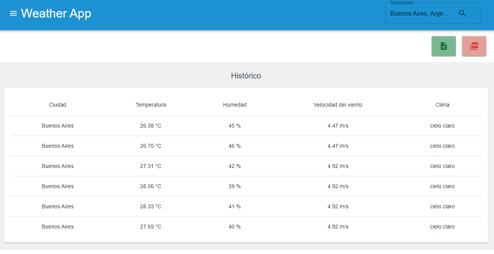

# Weather-app

Permite generar reportes partiendo de un historial de búsqueda del clima por sucursales de una compañía.
También muestra el clima actual de la sucursal y el pronóstico en las próximas horas.

## Características

- **Ingreso de una sucursal en el buscador:**

  - Pantalla Home mostrará el clima actual y el pronóstico

    

  - Pantalla Historico mostrará una grilla con datos y gráficos

    

    

- **Generación de reportes:**

  - Descarga de excel con data del historial
  - Descarga de pdf con gráficos
  - Cada gráfico puede descargarse de manera individual

## Tecnologías usadas

- React
- Typescript
- Vite
- TanStack Query (Manejo de peticiones)
- React Router
- Apex Chart (Gráficos)
- jsPDF (Generacion de PDF)
- xlsx (Generacion de excel)
- Material UI (Estilos)
- Lottie React (Animaciones)

## Dev

### Requisito

- Node.js (versión usada 20.17.0)

### Steps

1. Clonar repositorio
2. Instalar dependencias `npm install`
3. Copiar el archivo .env.template renombrar a .env
4. Generar api key
5. Iniciar servidor `npm run dev`
